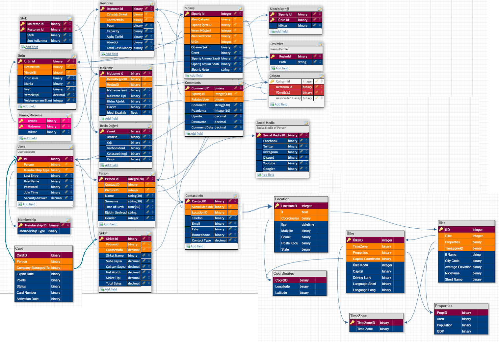

Developer Guide
===============

Database Design
---------------

In the database, information about the application and the users of the application are stored. 
The User Account Table stores information about the account. Each user has a membership type, a username and password, a join and last entry date, and a security question answer. The passwords of the users are encrypted. Each user is also a person in the Person Table. Each person has a name and surname, a date of birth, education level, and a gender. Each person has contact information in the Contact Information Table. The person's phone number, email, and several other fields are stored. Each contact info has a social media information in the Social Media table. Each social media row contains links to facebook, twitter, and several other links. Each person also has an image in the Photo Table, and each contact info has a location info in the Locations Table.

      The Database Diagram of the application.

Code
----

The application was coded with python using the flask framework. Other packages used were wtforms, colour, and passlib.

   .. code-block:: python

      class Foo:

         def __init__(self, x):
            self.x = x

.. toctree::

   member1
   member2
   member3
   member4
   member5
