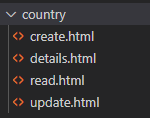

Parts Implemented by Uğur Demir
*******************************
Location
==========

Location table was initially implemented as table to hold location information of both users on consumer level 
and branches of bussinesses. It consists of 6 tables with 3 main tables and 3 side tables. These tables are highly connected
to each other with a single table connecting the entire block to the rest of the system. Apart from their non-key columns
main tables have foreign keys refrencing each other. One of the foreign keys of Location table references the main table Province
and one of the Province's foreign keys reference the other main table Country. The start of the development the system was planned as 
usable from different countries. Initialy location was suppose to be a side table however in order to provide everyone with three main
tables we were forced to expand upon it leaving to this not so efficient way of generation location information of users. 
Entries to Provinces and Countries tables cannot be done by the normal users they have to be done by the admins. Normal users can generate
locations using the provinces and countries already created and additionally entering their address details. In an ideal world, since
the amount of countries and provinces withing them would not be changing too much, having these two tables filled with static information
from a reliable and detailed enough source would have sufficed. 

Structure
=========
Each main table has it's own CRUD pages. Inputs are controlled by flask-WTForms.

After the delete operation the user is redirected to the main 
index.html so there is no delete.html.

The database operations are done in an another file called the {table_name}_model.py. Necessary queries are defined
and executed using the functions within the model files. 

Create Operation
=============
The returning values from a query had to be formatted in most cases before being sent to html. I used two main methods format incoming data
from the tables.Return value of get_results(cursor) is a 2d array which can be directly sent to html.

.. code-block:: python

    def get_results(cursor):
        desc = cursor.description
        column_names = [col[0] for col in desc]
        data = [dict(zip(column_names,row)) for row in cursor.fetchall()] #array of dict
        #data[0].values() values of the first row
        res = []
        for i in data:
            res.append(i.values())
        cursor.close()
        return (res) #2d array 

In this one the returning result is a dictionary with table's column names as key values.

.. code-block:: python

    desc = list(cursor.description[i][0] for i in range(0 ,len(cursor.description)))
    table = list(cursor.fetchone())
    result = dict(zip(desc, table))
    return result
    
Flask Form for location.

.. code-block:: python

    class Location(FlaskForm):
    country = SelectField("Country", choices=[(str(c_id),c_name) for c_id, c_name in country])
    province = SelectField("Province", choices=[(str(p_id), p_name) for p_id, p_name in province_list])
    county = StringField("County", validators=[DataRequired(message=msgRequired.format("County")), Length(max=40, message="County lenght has to be shorter than 40 characters")])
    neighborhood = StringField("Neighborhood", validators=[DataRequired(message=msgRequired.format("Neighborhood")),Length(max=40, message="Neighborhood lenght has to be shorter than 40 characters")])
    street = StringField("Street", validators=[DataRequired(message=msgRequired.format("Street")),Length(max=40, message="Neighborhood lenght has to be shorter than 40 characters")])
    zipcode = IntegerField("Zipcode", validators=[DataRequired(message=msgRequired.format("Zipcode")), NumberRange(min=10000, max=99999, message="Invalid Zipcode")])
    description = TextAreaField("Description", validators=[Length(max=200, message="Description cannot be longer than 200 characters" )])

            class Coordinates(FlaskForm):
            Longitude = FloatField("Longitude",validators=[NumberRange(min=-180, max=+180, message="Longitude needs to be between -180 and 180.")])
            Latitude = FloatField("Latitude", validators=[NumberRange(min=-90,max=90,message="Latitude needs to be between -90 and 90.")])

            class LocationForm(FlaskForm):
            location = FormField(Location)
            coord = FormField(Coordinates)
            submit = SubmitField( render_kw = { "class" : "btn btn-primary"})

In location.py in pages, we use create an instance of the flask form we designed and sent it to html.
        
.. code-block:: python

        def location_add_page():
            location = LocationForm()
            return render_template("/location/create.html", form = location)

In the location/create.html we have the following format for rendering the form.
       
.. code-block:: html

        

        <form method="post" action="{{ request.path }}" >
            {{ form.csrf_token }}

            
            
                

                <strong>{{ msg[i][0] }}</strong>
                

            
            
            <h1 class="display-4">Create <small class="text-muted font-italic">Location</small></h1>
            

            {{ form.location( class_ = "mt-5 table table-hover") }}
            <h1 class="display-4">Coordinates</h1>
            
  
            {{ form.coord( class_ = "mt-5 table table-hover") }}
            

            {{ form.submit }}
            <a href="{{ url_for('location_page') }}" class="btn btn-secondary">Cancel</a>
            

        </form>
        

For validating submissions from html in python we use validate_on_submit() method
        
.. code-block:: python
    :emphasize-lines: 3,4,5,6,7,8,9,10,11,12,13,14,15,16,17
        def location_add_page():
        location = LocationForm()
        if location.validate_on_submit():
            location_info = ( 
                int(location.location["province"].data),
                location.location["county"].data,
                location.location["neighborhood"].data,
                location.location["street"].data,
                location.location["zipcode"].data,
                location.location["description"].data
            )
            coord_info = (
                float(location.coord["Longitude"].data),
                float(location.coord["Latitude"].data)
            )
            location_id = add_location(location_info, coord_info)
            location = get_location(location_id)
            return render_template("/location/details.html", list = location)

        return render_template("/location/create.html", form = location)

Once the submission is validated two tuples, locations and coordinates, are filled with the submitted input. These tuples are then send to *location_model.py* to be inserted into a query and stored on the database.
|location_model.py
       
.. code-block:: python
        def add_location(location, coord):  
            with dbapi2.connect(DB_URL) as connection:
                with connection.cursor() as cursor:
                    print(location)
                    print(coord)
                    query = """INSERT INTO COORDINATES (LONGITUDE, LATITUDE) VALUES (%s,%s) RETURNING COORD_ID"""
                    #print(query % (coord[0], coord[1]))
                    cursor.execute(query,(coord[0], coord[1]))
                    retCoord = cursor.fetchone()[0]
                    query = """INSERT INTO LOCATION 
                    (province,
                    coordinates,
                    county,
                    neighborhood,
                    street,
                    zipcode,
                    description
                    ) VALUES (%s,%s,%s,%s,%s,%s,%s) RETURNING LOCATION_ID"""
                    cursor.execute(query, (location[0],retCoord,location[1],location[2],location[3],location[4],location[5]))
                    retLoc = cursor.fetchone()[0]
            return retLoc
For other province and country tables add operation is exactly the same with small query changes.
Read Operation
=================
The index.html expects a 2d array and unpacks elements accordingly
        
.. code-block:: html
        

            <a href="{{ url_for('location_add_page') }}" class="btn btn-primary" target="_self" title="Add">Add Entry</a>
        

         
        <h1 class="display-4">Location: Displaying {{ count }} Entries</h1>
        
            <form action="" method="post" name="location_list">
                <button type="submit" class="btn btn-danger">Delete Selected</button>
                

                <table class="table table-striped">
                    <thead>
                        <tr>
                            <th></th>
                            <th>Province</th>
                            <th>Country</th>
                            <th></th>
                            <th>Description</th>
                            <th>Zipcode</th>
                        </tr>
                    </thead>
                    <tbody>
                        
                        <tr>
                            <td>
                                <label class="checkbox">
                                    <input type="checkbox" name="location_keys" value="{{ Loc_id }}">
                                </label>
                            </td>
                            <td><a href="{{ url_for('province_read_page', province_key=P_key) }}">{{ P_name }}</a></td>
                            <td><a href="{{ url_for('country_read_page', country_key=C_key) }}">{{ C_name }}</a></td>
                            <td>{{ county }}, {{ neigh }}, {{ street }} </td>
                            <td>{{ description }}</td>
                            <td>{{ zipcode }}</td>
                            <td>
                            <nav class="nav">
                                <a class="nav-link text-success " href="{{ url_for('location_update_page', location_key=P_key) }}" >Update</a>
                                <a class="nav-link text-danger " href="{{ url_for('location_delete_page', location_key=P_key) }}" >Delete</a>
                            </nav>
                            </td>
                        </tr>
                        
                    </tbody>
                </table>
            </form>
        
        

the list is populated in location in pages through sql queries in location_model.py
       
.. code-block::python
        def location_page():
            location = get_all_location()
            return render_template("/location/index.html", list = location)
get_all_location in location_model.py

.. code-block::python
        def get_all_location():
            with dbapi2.connect(DB_URL) as connection:
                with connection.cursor() as cursor:
                    query = """select 
                    location_id,
                    country.country_id,
                    country.name,
                    province.province_id,
                    province.province_name,
                    county,
                    neighborhood,
                    street,
                    zipcode,
                    description from 
                    ((location join province on (location.province = province.province_id))
                    join country on (province.country = country.country_id))
                    """
                    cursor.execute(query)
                    return get_results(cursor)
For deleting with checkboxes selected in index.html we add the following to location.py
        
        ..code-block::python
        :emphasize-lines: 2,3,4
                def location_page():
                    if request.method == "POST":
                        for i in request.form.getlist("location_keys"):
                            delete_location(i)
                    location = get_all_location()
                    return render_template("/location/index.html", list = location)   
Unfinished / Problematic Features
==============
* Only the create location page was suppose to be accessable by the users, however the lack of authentcation allows anyone with the url can access the main pages of these tables and
do alterations. 
* While creating a location absance of javascript to hide option according to selected country allows users to combine a country with any of the provinces
. Plan was to filter the selectField options with java script once a country was selected but I was not able to built this feature. 
* Updating operation on locations doesn't work.
