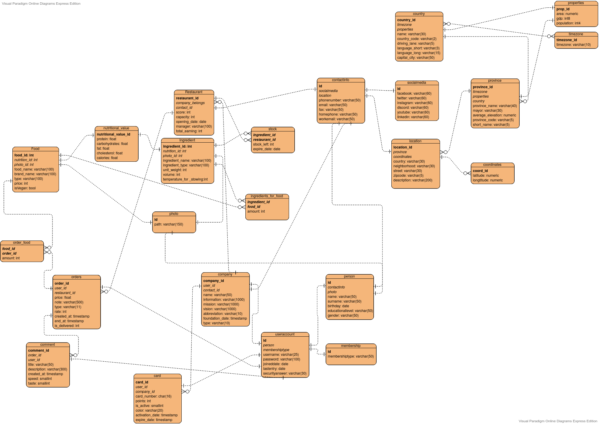

Welcome to itucsdb51's documentation!
=====================================

:Team: ITUCSDB1951

:Members:

   * İbrahim Berat Kaya
   * Metehan Seyran
   * Mehmet Can Gün
   * Uğur Demir

RestMang is a Restaurant Management App that lets the user organize your company and restaurants, or lets the user give orders from restaurants. With RestMang, the user may join as a boss or a customer. The boss may view the company and restaurant status and the customers may order from the restaurants.

E&R Diagram

   
   The E&R Diagram of the Database

Contents:

.. toctree::
   :maxdepth: 5

   user/index
   developer/index
