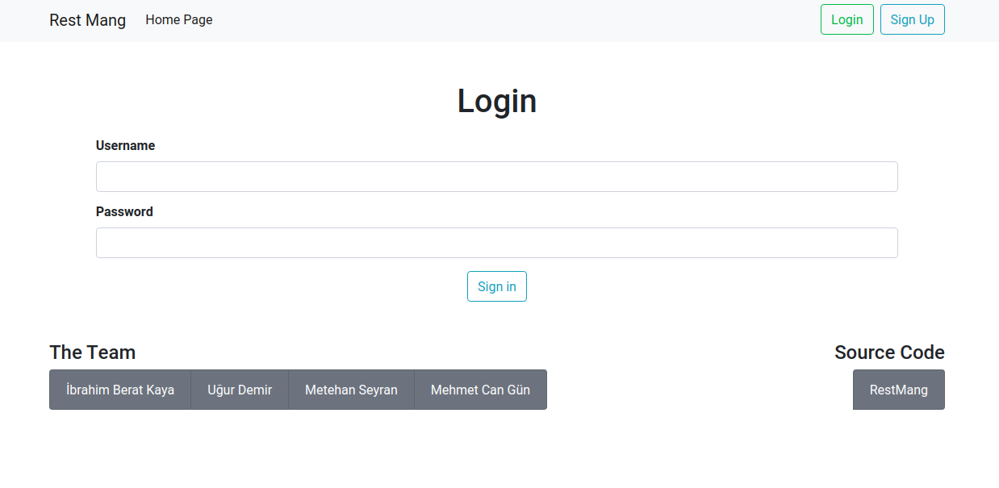

Parts Implemented by Member Name
================================

Login
========

The user who has an account may sign in from this page using the username and password of the user. Once the user enters the account information, they should click the sign in button. 
If the user enters a valid username and password, they will be redirected to the homepage. If the information is not correct, they will be alerted that they did not enter an existing username and password.

      The Login Page of the application.