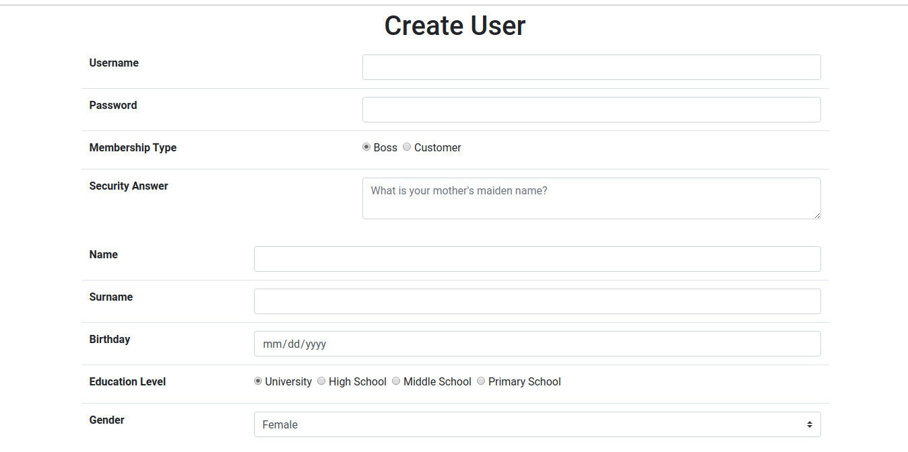
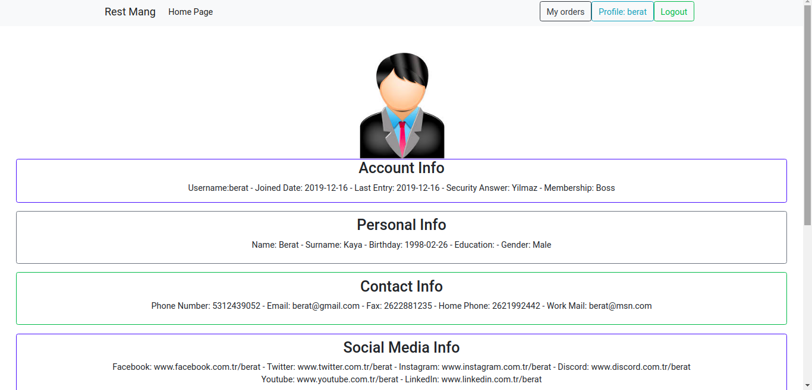

Parts Implemented by Ibrahim Berat Kaya
================================

Login
-----------

The user who has an account may sign in from this page using the username and password of the user. Once the user enters the account information, they should click the sign in button. 
If the user enters a valid username and password, they will be redirected to the homepage. If the information is not correct, they will be alerted that they did not enter an existing username and password.

.. figure:: login.png
      :scale: 50 %
      :alt: Login Page

      The Login Page of the application.

Sign Up
-----------

The user who would like to join this application may create an account by entering the required information. Once the user enters the account information, they should click the sign up button. 
If the user enters a valid username that currently does not exists, they will join RestMang, and they will be redirected to the homepage. If the username is already taken, they will be alerted that the username is already taken.

      The Sign Up Page of the application.

Profile 
-----------

The user who has an existing user account may view their information from the profile page. The profile page contains information about the account of the user, the personal information about the user, contact information about the user, social media links about the user, and the user's location information.

      The Profile Page of the application.