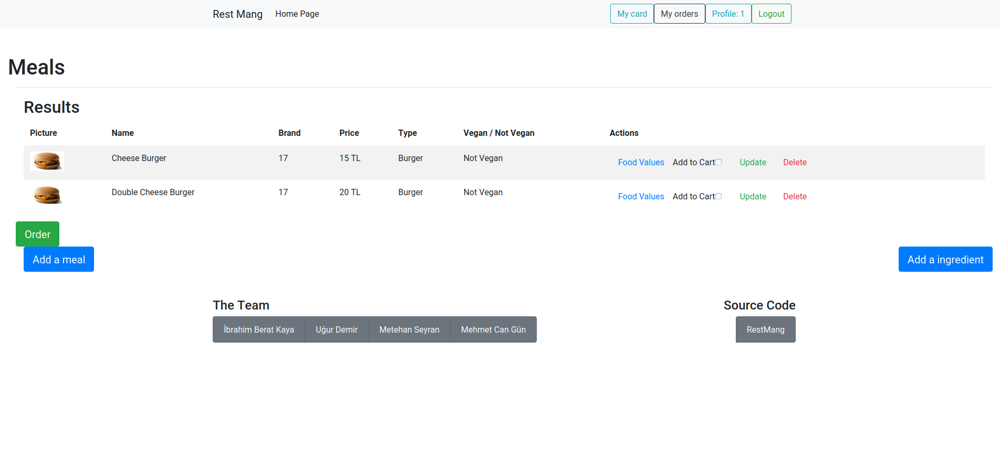
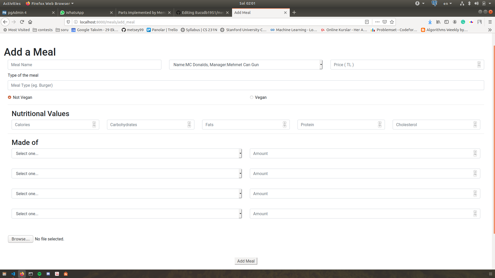
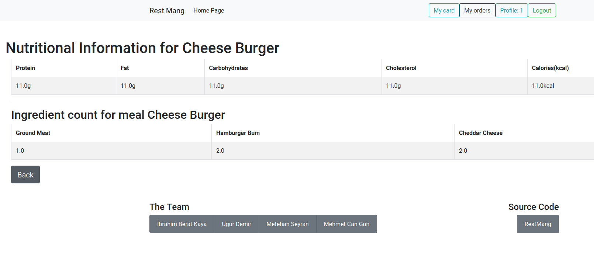
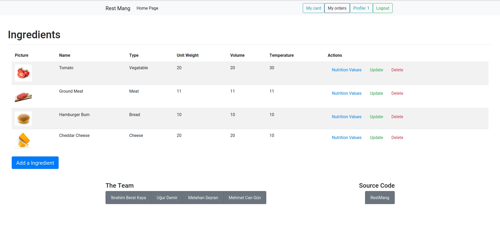
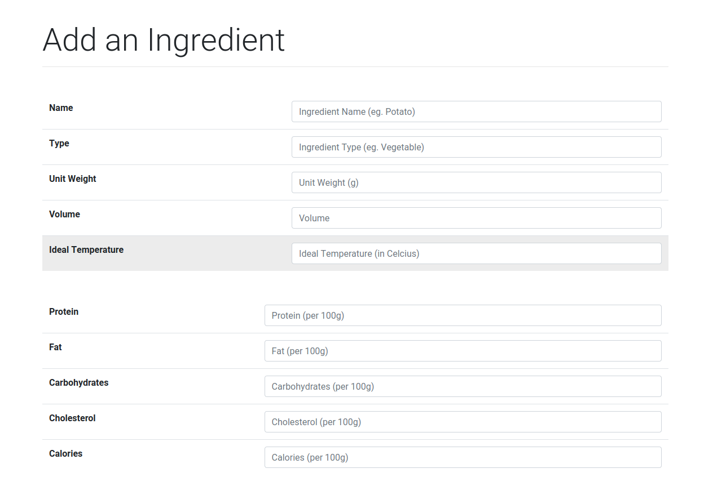
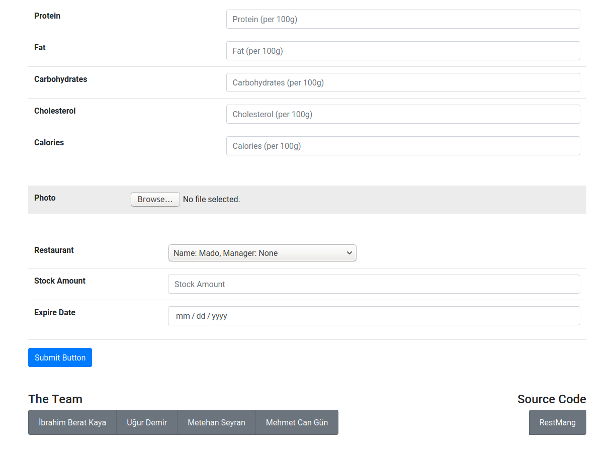

Parts Implemented by Metehan Seyran
************************************
Meals
-----------

Meal Page 
===============

This page shows all meals added by different restaurants. If a user logins as a boss, this person can modify meals and add a new one. If user logins as a customer, this person will only be able to see the nutritional value page for the specific meal. That customer can also order meals by selecting the checkbox near Add to Cart label. By selecting meals and pressing order, customer will be directed to order page to confirm his/her order. 

    The Meal Page

Add Meal Page
===============

This page contains inputs areas for all related information for food. Meal name, restaurant, price, meal type, vegan or not choice are directly related to meal. They are required to be filled. During ordering, a person will choose meal by firstly looking at those properies.
Next field is for nutritional value properies for that meal. Nutritional Value field contains calories, carbohydrates, fats, protein, and cholesterol values for that specific meal.
The last field containts options for meals, which will show this specific meal that is being added is made of. It is not required to fill all of the options, but 1 must be filled in. During filling, one should choose the ingredient and the amount of it in its own unit. For instance, if a person chooses olive oil as an ingredient, he or she must specify the amount in terms of milliliters, or liters. 
Although the photo part is optional, a user can insert a photo of a meal, in order for customer see what does that meal look like.
After filling the necessary forms, we are good to go. The meal is ready to be added to the meals page.

    The meal adding page

Nutritional information
===============
The user can be able to see the nutritional information such as calorie value, carbohydrate value, fat value, protein value and cholesterol value of that specific meal. The user can also get a table of ingredient list that meal is made of and amount of each ingredient.

    Nutritional information

Update&Delete Meal Page
===============
User can modify any meal by updating it. He or she can update the name, restaurant, price, type and even nutritional values of the meal. At the delete page, website will ask whether the user wants to delete that specific meal. If so it deletes the meal

Ingredients
---------------

Ingredient Page
===============

Ingredient page shows ingredients that all restaurants has added here. There are properties like name, type, unit weight, volume and temperature value for storage. These properties can help restaurants to locate, divide and store different ingredients in their optimal heat. There are also images of the ingredients to represent what they are. 
Only users which has membership type boss are able to add, modify and delete ingredients. Customers can only check nutritional value of that ingredient.

    The Ingredient Page

Add Ingredient Page
=================

Add ingredient page has different types of input ares, and lets user to enter information about a new ingredient. User can enter its name, type, unit weight, volume, and ideal temperature which are directly related to ingredient. 
User also able to enter nutritional values for that ingredient per 100g.

    The First half of Add Ingredient Page

User can add photo of the ingredient if he or she might like. Also user can select restaurant for that ingredient and directly add to that restaurant's stock. User can specify the stock amount of the ingredient and expiration date as well.

    The Second half of Add Ingredient Page

Nutritional Value Page
==================
All kinds of users are able to check the nutritional value of the specific ingredient. The page provides, calorie value, carbohydrate value, fat value, cholesterol value and protein value for that specific ingredient.

Update&Delete Page
==================
Users with type boss and admin are able to update and delete ingredients. In update section, they are able to update the ingredients' name, type, unit weight, volume and temperature for storing the ingredient.

.. figure:: updateingred.png
    :scale: 50 %
    :alt: Update Page

    Update Page Of specific Ingredient

In delete page, it checks one more time whether user wants to delete that specific ingredient. If so, it deletes the ingredient.

Restaurants
----------------