Parts Implemented by Mehmet Can Gün
************************************

Company
--------------

Index Company
===============

You will see all companies and see details about it.

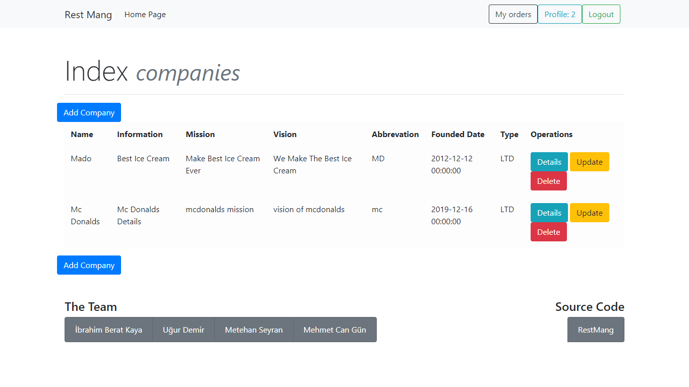

    Company Page

Create Company
===============

Do you wanna create your own restaurant business? Sign up as a boss and Login!
First, you need to give us basic information about name, vision, mission, contact details etc.
Then, we will create your business in our management system.

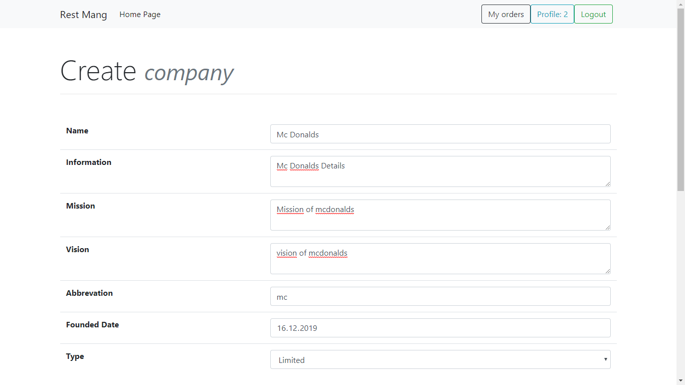

    Create Company

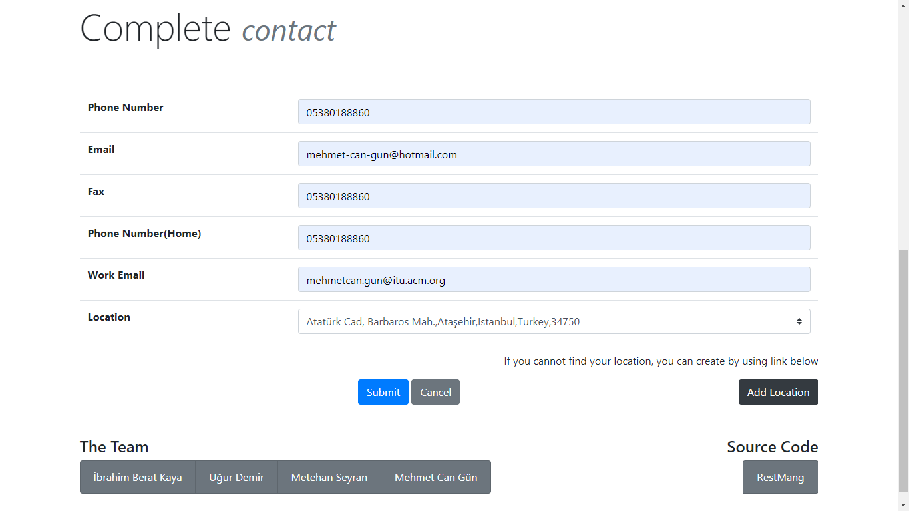

    Create contact

Update Company
===============

Just log in as a boss, you can change your company information like name, vision, mission etc.

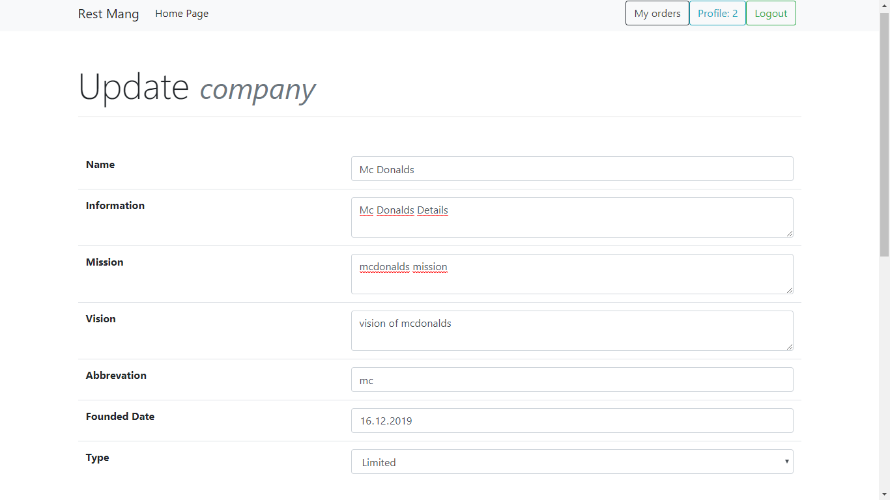

    Update Company

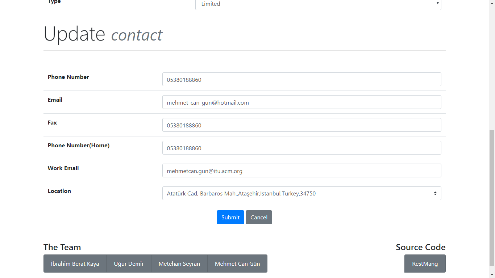

    Update contact

Delete Company
===============

Just log in as a boss, if you will delete your company, all data about your company will deleted.
For example, restaurant is connected to company, then restaurant which is related to be candidate company for delete operation will be deleted.

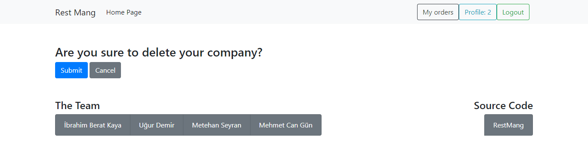

    Delete Company

Show Company Details
=====================

You can see details about company information, contact details and founder data.

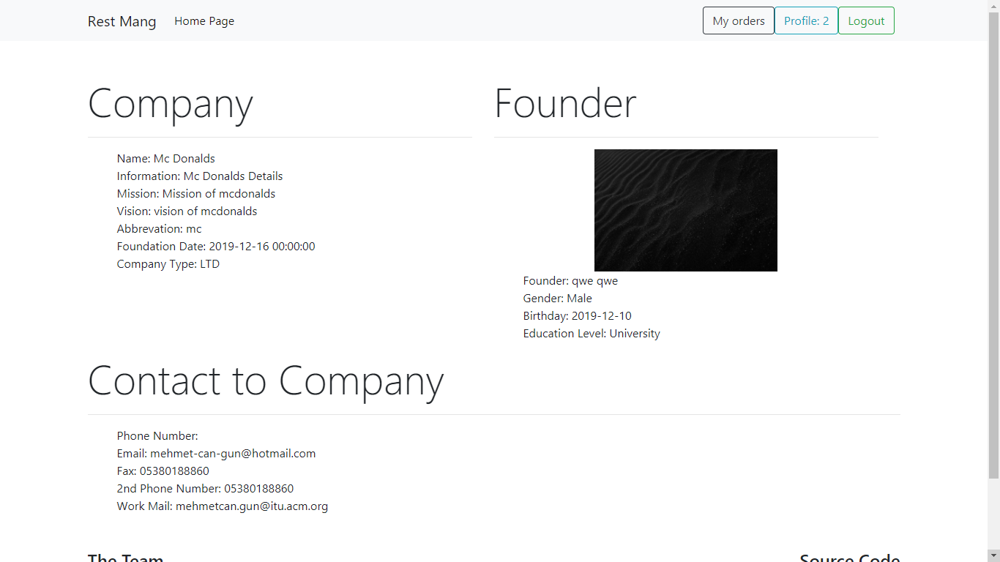

    Company Details

Set Founder
================

If company founder is resignation from company and the candidate company founder needs to be own it, then send mail admin to make you founder about company.

Card
--------------

Index Card
===============

This page shows cards includes person information.

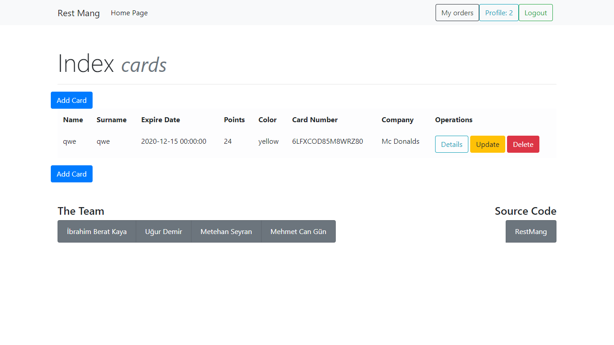

    Card Page

Create Card
===============

You need enter to the system as a company owner to create card for your customer.
Enter customer username and give starting points, status and color etc.

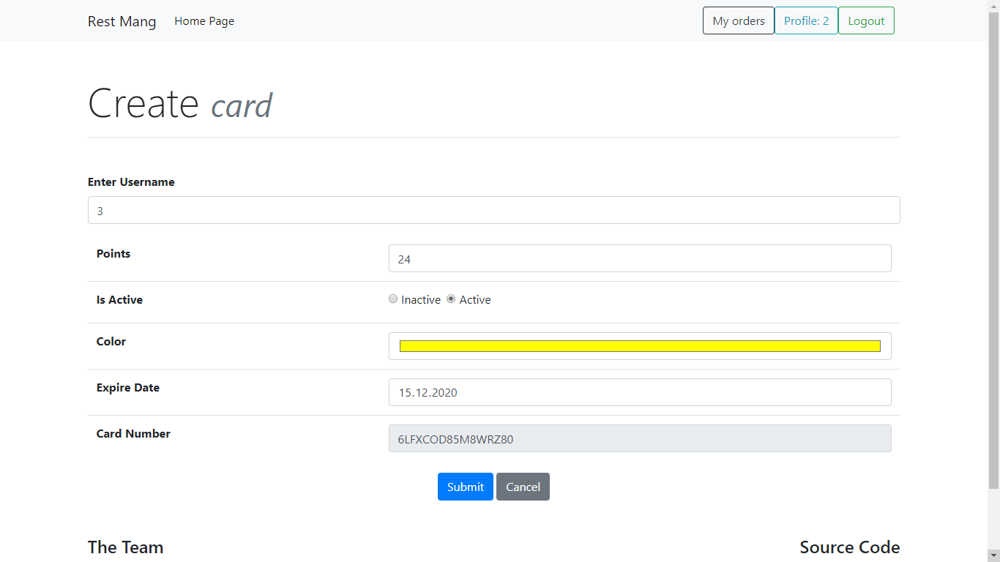

    Create Card

Update Card
===============

You need enter to the system as a company owner,
Update the fields related to card such as color, active status and expire date.

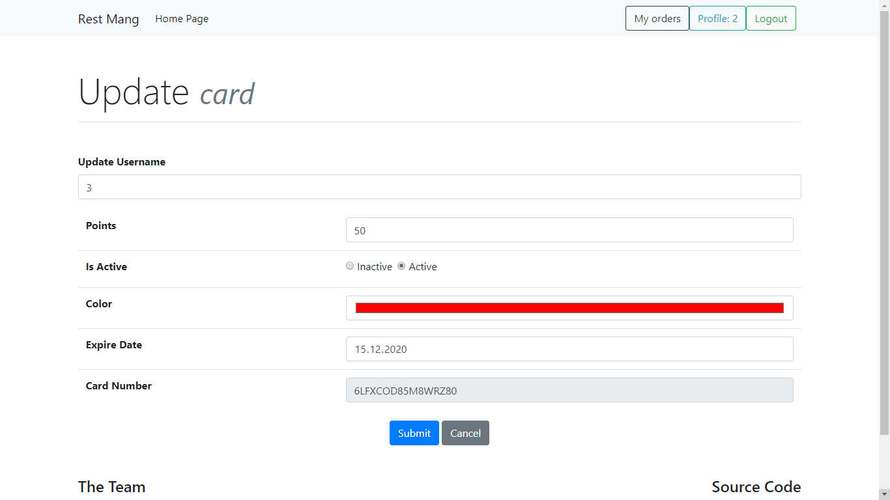

    Update Page

Delete Card
===============

You need enter to the system as a company owner,
Delete card related to user. This is just remove the card.

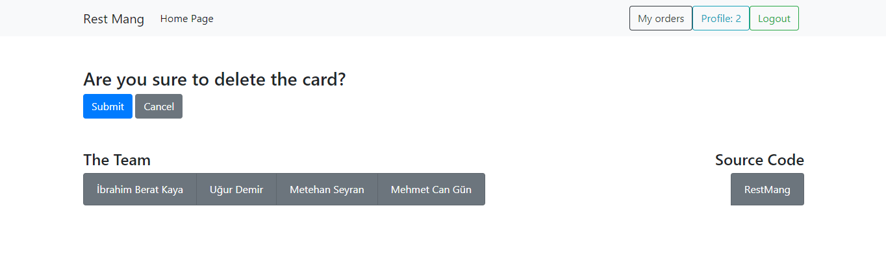

    Delete Page

Show Card Details
==================

Show your card details about customer info and company info.

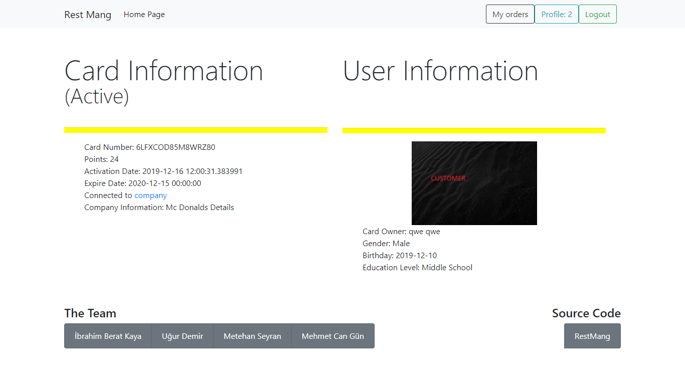

    Card Details

My Card
===============

Login as a customer, if the company owner create card for you, it will be shown in front page. 
Then, customer will be learn card details about customer info and company info

Order
--------------

Enter meal page, then select meal and click the order button to join payment page.

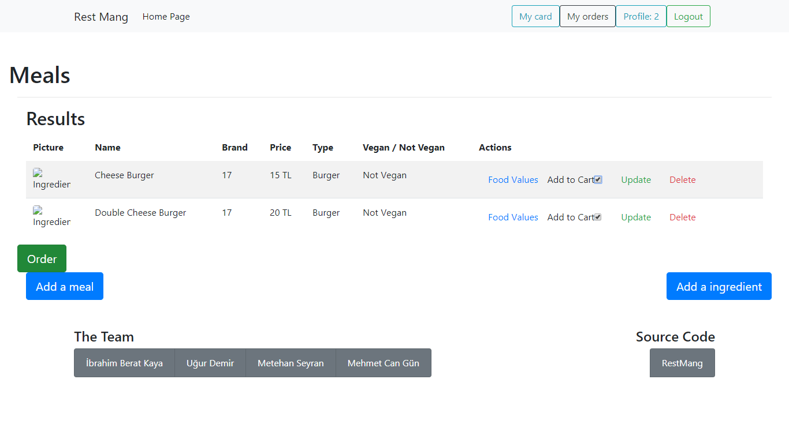

    Order Page

Order Index
===============

This pages shows orders.

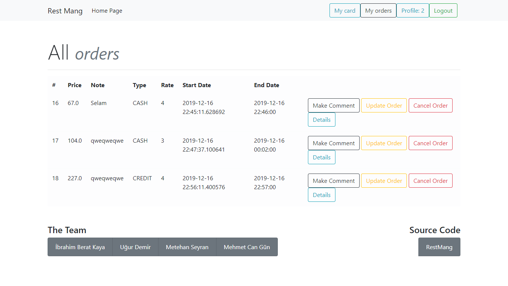

    Order Page

Payment
===============

After getting user meal from meal page, the amount of each food will be selected and order details such as note etc. need to enter, then the order will successfully created.

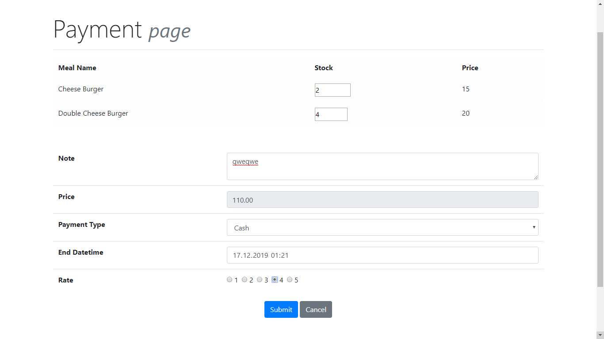

    Payment Page

Update Order
===============

Between starting time and expected deliver time, you will update your order status like note etc.

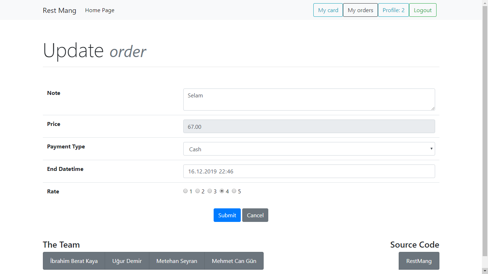

    Update Order

Cancel Order
===============

Between starting time and expected deliver time, you will cancel your order.

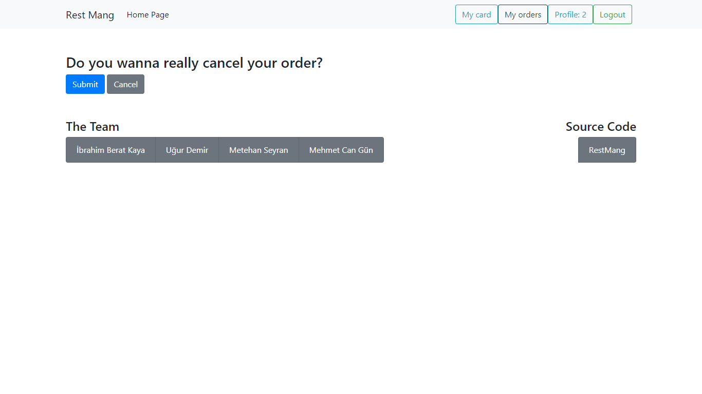

    Cancel Order

Show Order Details
===================

This page shows order details like what you are ordered, or which person gives that order in which company.
Also, this page shows the **comments** about order.

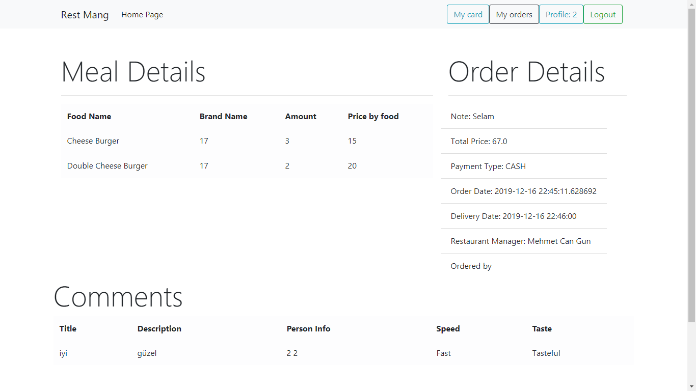

    Order Details

Delivered Order
================

After the time end, this button will be active to end your delivered status perfectly. This is accepted to pay the order. Then stock size reduced for related foods.

My orders
===============

Enter the system, then click the my orders button in header. This is shows the orders related about you.

Comment
===============

* Create Comment

| If the order is delivered correctly, then you will make comment with title, description, speed or taste status.

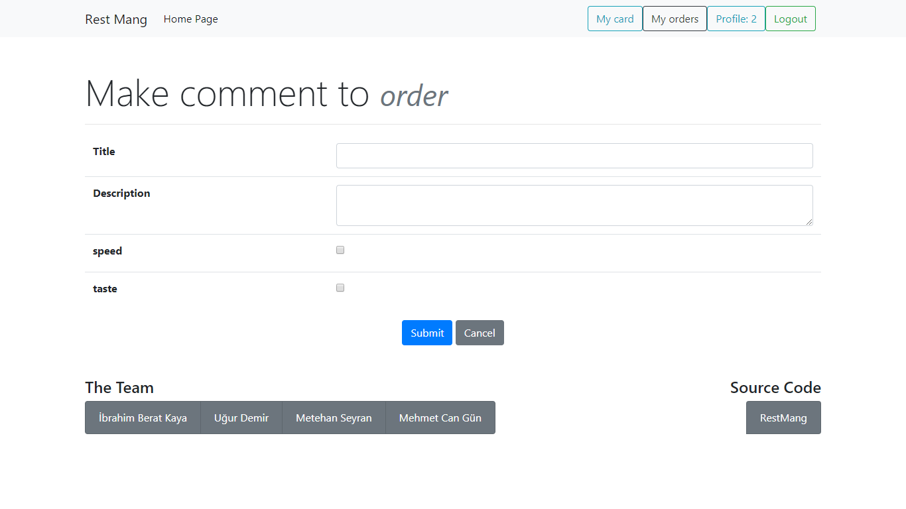

    Comment Order

* Show Comments 

| Enter the order detials page, then comments will be shown below the page.